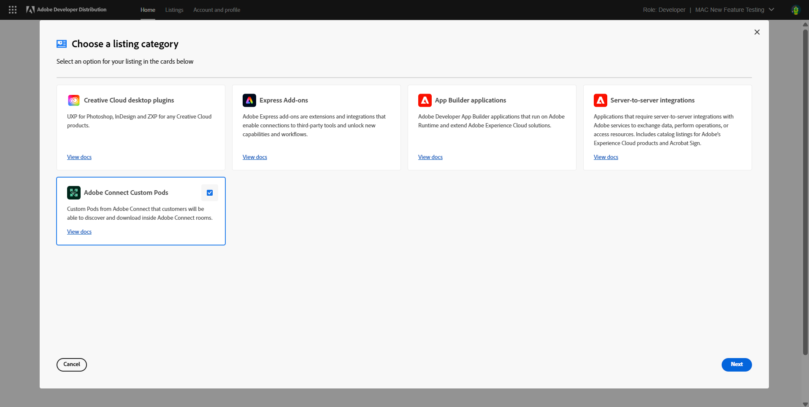
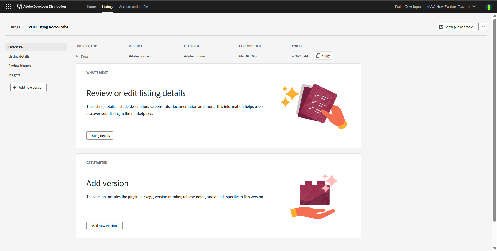

# Create a new listing

Learn how to create a new listing for Adobe Connect Custom Pod on Developer Distribution. 

A new listing can be created from the home page or the '**Your listings**' page. 

Clicking on ‘**Create a new listing**’ lands the developer on the modal overlay where they must choose the type of listing they want to create. Click on the '**Adobe Connect Custom Pods**' Card. Click on '**Next**'.

Once the listing type has been chosen, a new pod listing gets created. 

From here, the next step is to add the details of the Custom Pod listing. 

