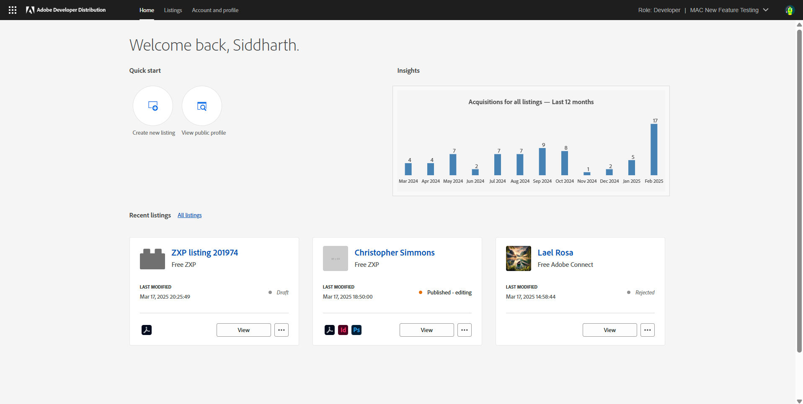
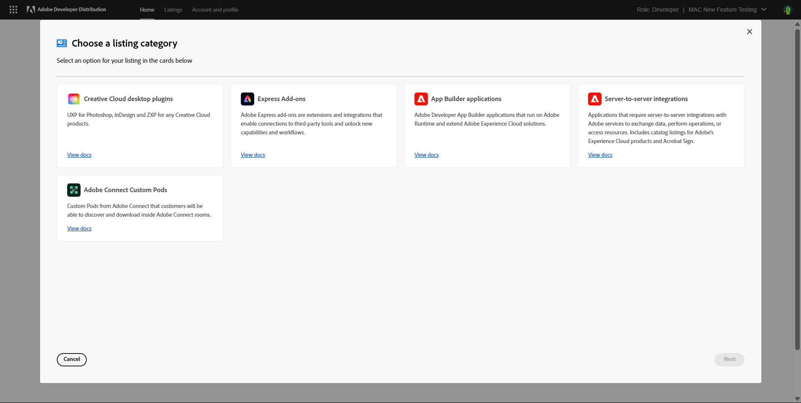

# Create a new listing

Learn how to create a new listing for Adobe Connect Custom Pod on Developer Distribution. 

A new listing can be created from the home page or the '**Your listings**' page. 

Clicking on ‘**Create a new listing**’ lands the developer on the modal overlay where they must choose the type of listing they want to create. Click on the '**Adobe Connect Custom Pods**' Card. 

