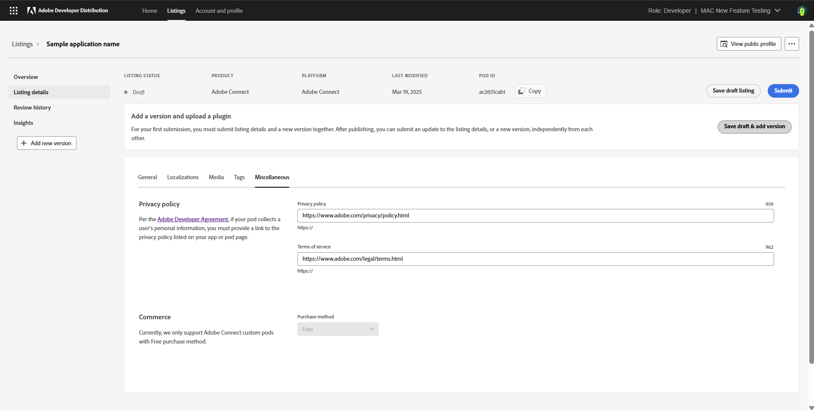

# Listing Details

Add details of your listing like Custom Pod name, media details, categories, and legal information. 

The developer can navigate to the “Listing details” page to add listing-level metadata details that help users discover their listing in the marketplace once it’s published.

This is the landing page to create a submission. Note the following items for Adobe Connect Custom Pod listings:

1. The navigation panel on the left confirms that this is the Listing Details screen.
2. The developer's role and organization name are listed in the upper right-hand corner. If any profile details need to be edited, click the "Edit Profile" tab.
3. The menu at the top of the screen indicates the listing status, the platform, the last modified date, and the Pod ID. The listing details for the app are ready to be added now.

Once details are added to the **General** tab, the developer can move onto the **Media** tab to add details like Custom Pod icon and screenshots. 

After adding the Custom Pod icon, screenshots, and screenshot captions, the developer can move onto next tab - **Tags**. 

Here, the category is a required field, and tags are optional. Select the categories (upto two) relevant for your custom pod, and then move onto the next section - **Miscellaneous**. 

While Privacy Policy and Terms of Use are optional fields on Developer Distribution, we highly recommend linking to your privacy policy and terms of use documents. At this point, Adobe Connect Custom Pod reviewers will reject any Custom Pods submission without a valid privacy policy or terms of use document. 

