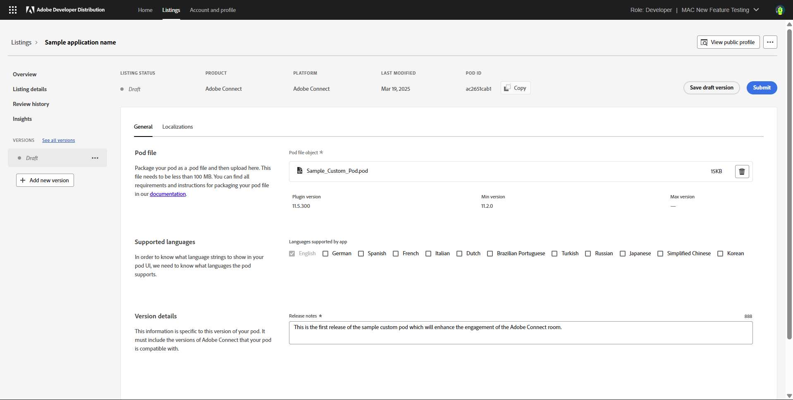
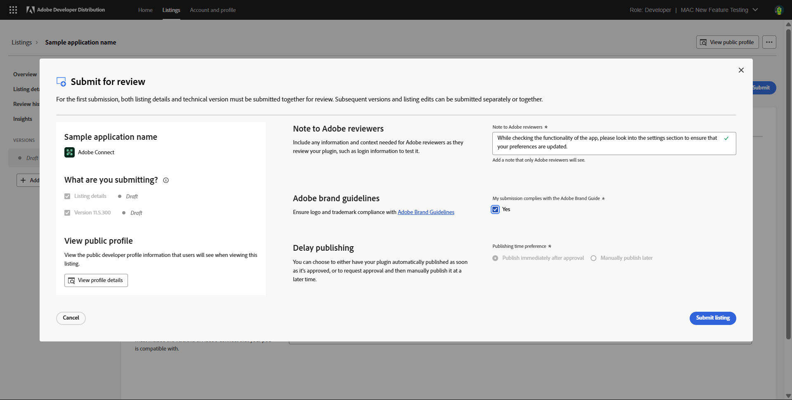

# Version Details

Learn about how to add version details for your Custom pod.

Adobe Connect custom pod requires a package to be uploaded and validated before the developer can submit the listing for Adobe’s review. The developer will see the option to '**Add new version**' in the left navigation bar. Clicking on ‘Add new version’ creates a new version and takes the developer to the '**Version Details**' page.

Add the custom pod package, select the languages supported by the custom pod, and add release notes for the version being submitted. Once this is done, you can click on **Submit**.

At this point, a modal will open to seek additional details around the submission. Once these details are filled, the listing can be submitted to Adobe for review. Once submitted, you will receive a confirmation mail on your registed email. Adobe will typically take less than 10 days to review a Custom Pod submission. If we need additional details or changes to the custom pod package, we will request more details. The details can be shared and the listing or version can be resubmitted on Developer Distribution. 

